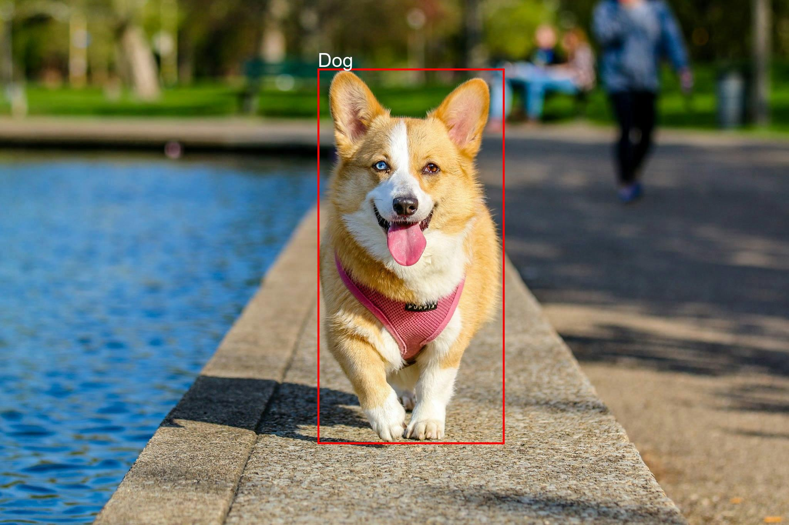
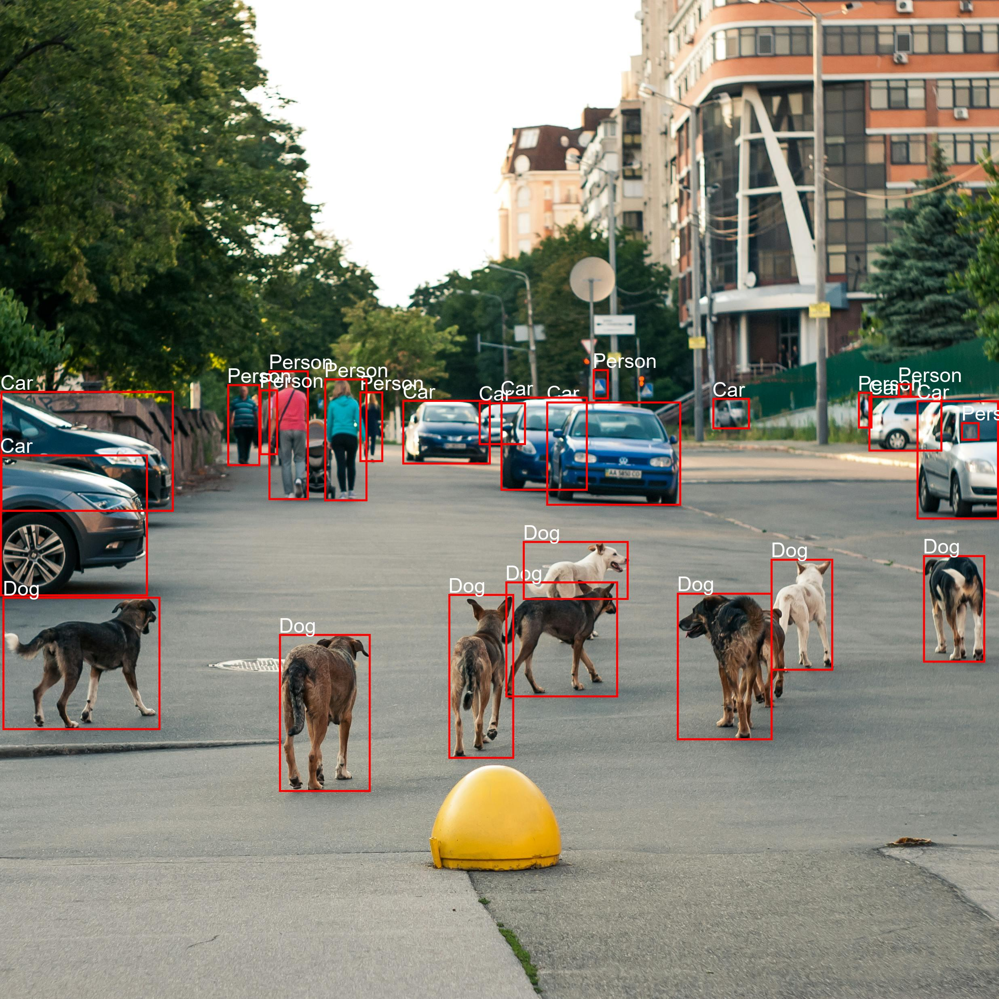

# Image Labels Generator using Amazon Rekognition

This Python project uses **Amazon Rekognition** and **Pillow** to detect labels in images and draw bounding boxes around detected objects. The project uploads images to **Amazon S3**, uses **Rekognition** to detect objects, and saves the modified images with bounding boxes and labels.

## **AWS Services Used**
1. **Amazon S3**:  
   Used for storing images and serving them via a static website.
   
2. **Amazon Rekognition**:  
   Utilized for detecting labels (e.g., Person, Dog, Cat) and bounding boxes in the images.

3. **Pillow**:  
   Used for manipulating images by drawing bounding boxes and labels on them.

## **Deployment Instructions**
Follow these steps to deploy the project on your AWS account:

1. **Create an S3 Bucket**:
   - Name the bucket (e.g., `image-labels-generator`).
   - Ensure **public access settings** are configured correctly for storing images.

2. **Upload Website Files**:
   - Upload your project files (e.g., `image_labels_generator.py`, any images, etc.) to the S3 bucket for processing.

3. **Set Up IAM Permissions**:
   - Make sure the IAM role or user you're using has the necessary permissions to use **Amazon Rekognition** and **S3**.

4. **Run the Python Script**:
   - Ensure you have **Python 3.x**, and install the required libraries:
     ```bash
     pip install boto3 pillow
     ```
   - Execute the script:
     ```bash
     python image_labels_generator.py
     ```

5. **Access the Processed Images**:
   - After running the script, the labeled images will be saved locally on your machine or uploaded back to the S3 bucket if desired.

## **Screenshots**
Here are some screenshots of the processed images after running the Python script:

### Example 1: Detected Labels on Image



### Example 2: Detected Labels on Another Image



### Example 3: Detected Labels on a Different Image


### Output generated in command prompt interface.

.png)


## **Lessons Learned**
- How to use **Amazon Rekognition** to detect objects and labels in images.
- Using **Pillow** for image manipulation, such as drawing bounding boxes and adding text labels.
- How to automate the process of labeling and annotating images using AWS services and Python.

## **Next Steps**
- Expand the project by integrating **Amazon CloudFront** to serve images with HTTPS support.
- Add more **metadata** to the labels, such as custom annotations like **temperature**, **time**, etc.
- Automate deployment with **AWS Lambda** or **AWS CloudFormation** to create a fully serverless solution.

## **Author**
[Vishnu Vardhan Gurram](https://github.com/vishnuvardhan148)  
Feel free to reach out with any questions or feedback!


